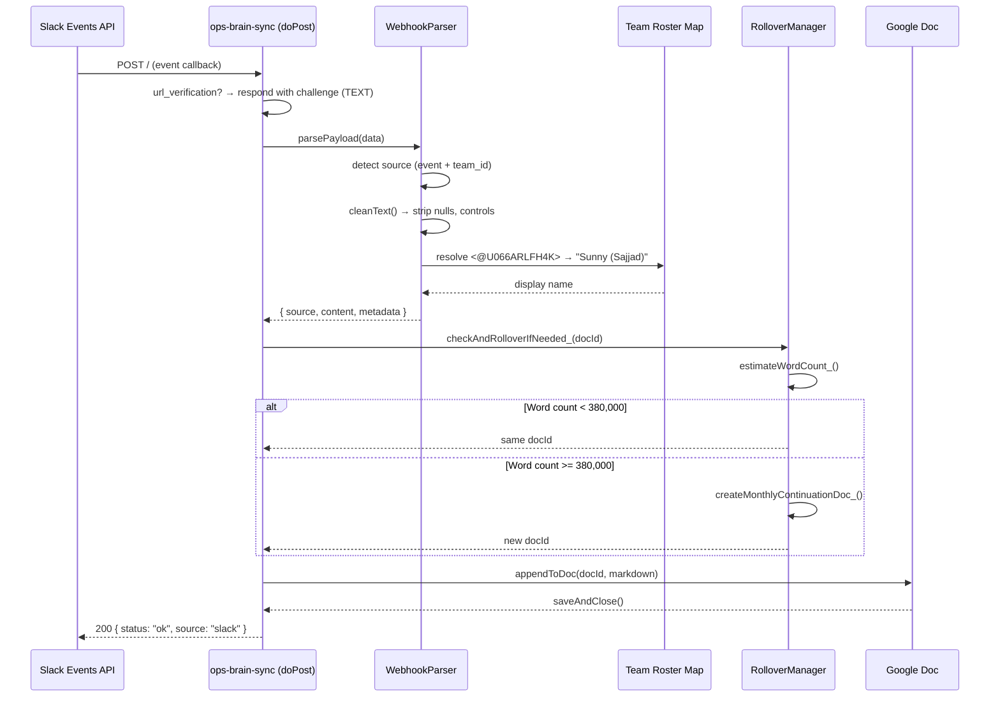
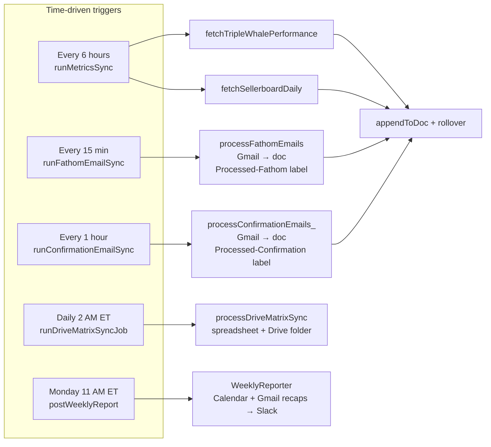

# ops-brain-sync

**Automated operations pipeline engine** connecting Slack webhooks, Fathom video recaps, Triple Whale analytics, Sellerboard financials, and Gmail confirmation matrices to a centralized Google Workspace data sync layer — optimized for high-accuracy NotebookLM contextual ingestion.

---

## Executive Overview

ops-brain-sync is a serverless Google Apps Script data integration engine that operates as both a real-time webhook receiver and a scheduled polling orchestration layer. It ingests operational intelligence from four primary data planes — team communications (Slack), meeting intelligence (Fathom), e-commerce analytics (Triple Whale), and financial performance (Sellerboard) — and pipes clean, structured Markdown into a centralized Google Doc repository for downstream AI-augmented retrieval in NotebookLM.

### Core Objectives

| Objective | Description |
|-----------|-------------|
| **Noise Minimization** | Strip webhook metadata, Slack internal IDs, and `@mention` piping syntax before ingest, preserving only human-readable business context |
| **Identity Translation** | Resolve raw Slack user IDs (`U066ARLFH4K`) to real-world display names via a centralized team roster — ensuring LLM context never contains opaque internal tokens |
| **RAG Optimization** | Structure every payload as clean hierarchical Markdown (`###`, `---`, sanitized key/value pairs) to maximize NotebookLM's chunking and retrieval precision |
| **Self-Healing Capacity** | Automatically detect document word-count thresholds (~380K) and spin up monthly continuation documents before hitting NotebookLM's 500K processing ceiling |

### Processing Statistics

| Constraint | Limit | Mitigation |
|-----------|-------|------------|
| Document word ceiling | ~380,000 (warning) / 500,000 (NotebookLM hard cap) | Automated monthly rollover via `safeCheckAndRollover_` |
| Script execution timeout | 6 minutes (Apps Script hard limit) | Split background jobs (`BackgroundSync.js`); per-job batch sizes and time guards |
| Webhook payload truncation | ~15,000 characters per append (document bloat guard) | `cleanText()` strips control characters, collapses excess whitespace |
| Lock contention | 30,000 ms `LockService.waitLock` on Gmail jobs | Fathom + confirmation syncs serialize via script lock; doc appends retry on transient Docs errors |

---

## System Architecture

The engine operates two concurrent core mechanisms: an **asynchronous webhook ingestion path** (`doPost`) for live Slack events, and a **split time-driven sync engine** (`BackgroundSync.js`) where each heavy job runs on its own schedule so no single execution hits the 6-minute limit.

### Sequence Diagram: Slack Webhook Lifecycle



### Architecture Flowchart: Split Background Jobs

Each job is an independent Apps Script time trigger. Jobs may overlap; Gmail processors share a script lock.



**One-time setup:** run `installBackgroundTriggers()` in `BackgroundSync.gs` and `installWeeklyReportTrigger()` in `WeeklyReporter.gs`. The legacy monolithic `runBackgroundSyncs` handler is deprecated.

---

## Module Inventory

| Module | File | Type | Responsibility |
|--------|------|------|----------------|
| **Ingress Controller** | `Code.js` | Entry point | `doGet` (health-check), `doPost` (webhook receiver), shared config helpers, `safeCheckAndRollover_`, Slack mention cleanup |
| **Background Orchestrator** | `BackgroundSync.js` | Scheduler | Split time-driven jobs, `installBackgroundTriggers()`, Gmail confirmation processing with label dedup |
| **Webhook Router** | `WebhookParser.js` | Parser | Route payloads by shape: Slack `event+team_id`, Fathom `recording`, Triple Whale `event_type+data`, Sellerboard `source`, generic fallback |
| **Markdown Transformer** | `MarkdownFormatter.js` | Formatter | Convert parsed payloads to clean Markdown. Timestamps in `America/New_York` |
| **Doc Writer** | `DocAppender.js` | Writer | Open doc by ID, append Markdown with heading styles, exponential backoff on Docs write failures |
| **Rollover Guard** | `RolloverManager.js` | Guard | Estimate word count; create `ops-brain-sync YYYY-MM` doc at ~380K words; update `TARGET_DOC_ID` |
| **Fathom Fetcher** | `FathomFetcher.js` | Gmail poller | Search Fathom recap emails, append to doc, apply `Processed-Fathom` label (batch + time limits) |
| **Triple Whale Fetcher** | `TripleWhaleFetcher.js` | Poller | POST to Triple Whale summary endpoint; render metrics as Markdown |
| **Sellerboard Fetcher** | `SellerboardFetcher.js` | Poller | Fetch CSV from pre-signed URL; extract latest row as key/value table |
| **Drive File Fetcher** | `DriveFileFetcher.js` | Crawler | Deep-crawl master spreadsheet; save Markdown snapshots to NotebookLM folder |
| **Weekly Reporter** | `WeeklyReporter.js` | Reporter | Monday Slack digest from Calendar + Gmail/doc recaps; `installWeeklyReportTrigger()` |

---

## Configuration

### Script Properties (Environment Control Plane)

Set these in the Apps Script editor under **Project Settings > Script Properties**, or programmatically via `PropertiesService.getScriptProperties()`:

| Property | Purpose | Required |
|----------|---------|----------|
| `TARGET_DOC_ID` | Primary Google Doc ID for Markdown output | Yes |
| `MASTER_SPREADSHEET_ID` | Master Operations & Data Matrix (SSOT) | Yes (for Drive matrix job) |
| `NOTEBOOK_SOURCE_FOLDER_ID` | Drive folder containing NotebookLM source docs | Yes (for Drive matrix job) |
| `FATHOM_API_KEY` | Fathom API key (optional fallback; Gmail is primary) | No |
| `TRIPLE_WHALE_API_KEY` | Triple Whale API key | Yes (for metrics job) |
| `SELLERBOARD_DAILY_LINK` | Pre-signed URL for daily Sellerboard CSV | Yes (for metrics job) |
| `SLACK_WEBHOOK_URL` | Incoming webhook for weekly Slack digest | Yes (for weekly report) |
| `OPS_CALENDAR_ID` | Google Calendar ID for weekly meeting list | Yes (for weekly report) |
| `OPS_CALENDAR_DEDICATED` | Set to `true` if calendar is ops-only (no title filter) | No |
| `OPS_REPORT_TZ` | Timezone for report week boundaries (default `America/New_York`) | No |

### Timezone

All timestamps across the pipeline use `America/New_York` as the canonical timezone. Configured in `appsscript.json`:

```json
{
  "timeZone": "America/New_York",
  "runtimeVersion": "V8",
  "webapp": {
    "access": "ANYONE",
    "executeAs": "USER_DEPLOYING"
  }
}
```

---

## The Master Operations & Data Matrix

The **Master Operations & Data Matrix** (a Google Sheet identified by `MASTER_SPREADSHEET_ID`) serves as the single source of truth (SSOT) and configuration manager for the pipeline. It holds:

- **Script Properties Synchronizer** — Centralized registry for operational IDs (`TARGET_DOC_ID`, `NOTEBOOK_SOURCE_FOLDER_ID`) that the pipeline reads on each execution cycle
- **Self-Healing Spreadsheet Sanitization** — Validation routines (`sanitizeSpreadsheetId`, `getValidSpreadsheetId`) that intercept malformed input patterns (casing mismatches, trailing key artifacts) and resolve them via canonical matching to prevent catastrophic lockups
- **Volume Matrix Log Guard** — Tracks which document versions and months are active; cross-references with RolloverManager's word-count estimates so the pipeline never writes to a full doc

**SSOT read cycle** (at the start of `runDriveMatrixSyncJob`):

```
Spreadsheet (MASTER_SPREADSHEET_ID)
  └── sheet: "Config"
        ├── TARGET_DOC_ID        → DocAppender
        ├── NOTEBOOK_SOURCE_FOLDER_ID → Drive matrix snapshots
        └── ROLLOVER_TRACKER     → RolloverManager
```

---

## Centralized Team Roster Mapping

To ensure raw Slack user IDs never reach NotebookLM, the pipeline maintains a centralized display-name translation dictionary. When `cleanSlackUserMentions` (or the equivalent regex pass in `WebhookParser`) encounters a `@mention` token, it resolves the embedded ID against this roster:

| Slack User ID | Display Name |
|---------------|--------------|
| `U066ARLFH4K` | Sunny (Sajjad) |
| `U4Y0JPMD4` | Rick Reichmuth |
| `U5206HQ00` | Diego Marquez |
| `U08F1V0FPDY` | Allyse C |
| `UQC0FDA2Z` | Stifany Ong |
| `U04PH549Z3N` | Paula Bacolod |
| `U08E1C77J77` | Arqam |
| `U03SW53P95E` | Mollie Cutillo |
| `U0AMTGG4XRD` | Marco Gastelum |

The resolution uses recursive regex lookarounds to handle both bare `<@U12345>` tokens and complex piping syntax like `<@U12345\|user>`:

```
Pattern:  /<@(U[A-Z0-9]+)(?:\|[^>]+)?>/g
Replace:  lookup[matchedId] || matchedId
```

If a user ID is not found in the roster, the raw `@mention` token is preserved rather than silently dropped — ensuring visibility into unmapped identities.

---

## Production Roadblocks & Edge-Case Mitigation

### Slack Identity Masking

**Problem:** Slack's Events API delivers user mentions as opaque internal IDs in both bare (`<@U12345>`) and piped (`<@U12345\|display>`) formats. Naive string replacement fails on the piping variant because the regex must match the optional `|user` segment without consuming the display label.

**Solution:** A two-pass sanitization strategy:
1. **Extract** — Regex extracts the user ID (`U[A-Z0-9]+`) from any `<@...>` token
2. **Resolve** — Look up the ID in the team roster map; if found, substitute the canonical display name. If not found, leave the token intact as a signal for roster maintenance

### Concurrency Lockouts

**Problem:** Multiple time-driven triggers can fire at once (e.g. Fathom every 15 min overlapping with hourly confirmations, or a manual editor run during a scheduled run).

**Solution:**

1. **Gmail jobs** (`runFathomEmailSync`, `runConfirmationEmailSync`) acquire a shared `LockService.getScriptLock()` with a 30-second wait. If the lock is busy, the job logs `Lock busy — skipping cycle` and exits — the next scheduled run retries. Labels are applied only after a successful doc append, so skipped cycles do not lose data.

2. **Doc writes** (`appendToDoc`) use exponential backoff (3 attempts) for transient Google Docs concurrency errors when metrics or webhooks write while a Gmail job is running.

3. **Drive matrix** runs independently (spreadsheet + folder, not the Gmail lock).

```
// BackgroundSync.js / FathomFetcher.js — Gmail serialization
var lock = LockService.getScriptLock();
try {
  lock.waitLock(30000);
  // ... Gmail search, append, label ...
} catch (e) {
  console.warn('Lock busy — skipping cycle');
  return;
} finally {
  lock.releaseLock();
}
```

### Payload Size & Truncation Boundaries

**Problem:** Overly large webhook payloads (e.g., Fathom transcripts exceeding 15K characters) create document bloat and risk running up against execution time limits.

**Solution:** Each module enforces a maximum content body of ~15,000 characters. `cleanText()` in `WebhookParser.js` strips control characters, null bytes, and collapses excessive blank lines before formatting. The 100-character word-wrap in `formatContentBody()` further constrains the final append size.

### NotebookLM Latency Boundary

**Critical operational checkpoint:** NotebookLM maintains **static cache snapshots** of Google Drive source documents. When new data is written:

```
Pipeline writes to Google Doc ✓
         │
         ▼
NotebookLM cache is STALE
         │
         ▼
Manual "Source Refresh" required in NotebookLM UI
```

The engine cannot programmatically trigger a NotebookLM refresh — no API exists for this. Users must click the refresh icon on the source document within NotebookLM after each sync cycle to update the AI model's context window.

### Document Rollover at Capacity

**Problem:** NotebookLM enforces a hard 500,000-word processing limit per document. Once breached, the document becomes inaccessible to the model.

**Solution:** The `RolloverManager` monitors document word count via `estimateWordCount_()` (whitespace splitting). At ~380,000 words (a 120K safety margin), it triggers `createMonthlyContinuationDoc_()`:

1. Creates a new doc named `ops-brain-sync YYYY-MM` via `DocumentApp.create()`
2. Writes an identifying header and timestamp
3. Persists the new doc ID to `TARGET_DOC_ID` in ScriptProperties
4. Returns the new ID — the caller seamlessly continues appending to the fresh document

### Execution Time Ceiling (per-job batching)

**Problem:** Apps Script enforces a strict 6-minute execution limit per trigger. The previous monolithic `runBackgroundSyncs` ran Drive crawl, Fathom API, Fathom Gmail, Triple Whale, Sellerboard, and confirmation emails in one execution — routinely hitting timeouts (~80% failure rate).

**Solution:** Split into independent handlers in `BackgroundSync.js`, each with its own schedule and local time limits:

| Job | Local time guard | Batch size |
|-----|------------------|------------|
| `runFathomEmailSync` | 5 min (`processFathomEmails`) | 5 Gmail threads |
| `runConfirmationEmailSync` | 4.5 min | 5 Gmail threads |
| `runMetricsSync` | Per-fetcher (API calls only) | N/A |
| `runDriveMatrixSyncJob` | Loop guards in `DriveFileFetcher` | Off-hours daily run |

Each job wraps failures in try/catch so one API outage does not block unrelated syncs. `runBackgroundSyncs` is deprecated and performs no work.

---

## Quick Start

### Prerequisites

- Node.js >= 18
- Google account with [Apps Script API enabled](https://script.google.com/home/usersettings)

### Setup

```bash
# Clone the repository
git clone https://github.com/your-org/ops-brain-sync.git
cd ops-brain-sync

# Install clasp globally (or use npx)
npm install

# Authenticate with Google
npm run login

# Create the Apps Script project (one-time)
clasp create --type standalone

# Push all modules
npm run push

# Deploy as web app
npm run deploy
```

### One-Time Trigger Installation

After each `clasp push`, open the script in the Apps Script editor:

```bash
npm run open
```

Run these **once** (function dropdown → Run → authorize if prompted):

| Function | File | Creates |
|----------|------|---------|
| `installBackgroundTriggers()` | `BackgroundSync.gs` | Four split background triggers (removes legacy `runBackgroundSyncs`) |
| `installWeeklyReportTrigger()` | `WeeklyReporter.gs` | Monday 11:00 AM ET → `postWeeklyReport` |

Verify on the **Triggers** page (clock icon):

| Handler | Schedule |
|---------|----------|
| `runFathomEmailSync` | Every 15 minutes |
| `runConfirmationEmailSync` | Every hour |
| `runMetricsSync` | Every 6 hours |
| `runDriveMatrixSyncJob` | Daily ~2:00 AM ET |
| `postWeeklyReport` | Monday 11:00 AM ET |

Delete any leftover `runBackgroundSyncs` trigger if it still appears.

### Verifying & Smoke Testing

Triggers run automatically after installation — manual runs are optional.

1. **Executions** — Within ~15–30 minutes, `runFathomEmailSync` should appear with source **Trigger** and status **Completed**.
2. **Manual smoke test** — Run individual handlers from the editor (`runFathomEmailSync`, etc.) and check logs in Executions.
3. **Lock busy** — If two Gmail jobs overlap, one logs `Lock busy — skipping cycle`; harmless, retries on next interval.
4. **Deprecated handler** — Running `runBackgroundSyncs` should complete instantly with a deprecation warning only.

Diagnostic helpers in `WeeklyReporter.gs`: `debugWeeklyGmailRecaps()`, `listAccessibleCalendars()`.

---

## Development Commands

| Command | Action |
|---------|--------|
| `npm run login` | Authenticate clasp with Google |
| `npm run push` | Push local code to Apps Script |
| `npm run pull` | Pull remote code from Apps Script |
| `npm run deploy` | Deploy current version as web app |
| `npm run open` | Open the project in Apps Script editor |

---

## Webhook Endpoints

| Method | Path | Content-Type | Handler | Purpose |
|--------|------|-------------|---------|---------|
| `GET` | `/exec` | `application/json` | `doGet` | Health-check: `{ status, service, timestamp }` |
| `POST` | `/exec` | `application/json` | `doPost` | Webhook ingress (Slack, Fathom, Triple Whale, Sellerboard) |

### Slack url_verification Handshake

```bash
curl -X POST https://script.google.com/macros/s/{DEPLOY_ID}/exec \
  -H "Content-Type: application/json" \
  -d '{"type": "url_verification", "challenge": "abc123"}'

# Response: 200 OK (Content-Type: text/plain)
# abc123
```

---

## License

ISC — See [LICENSE](LICENSE) for details.
