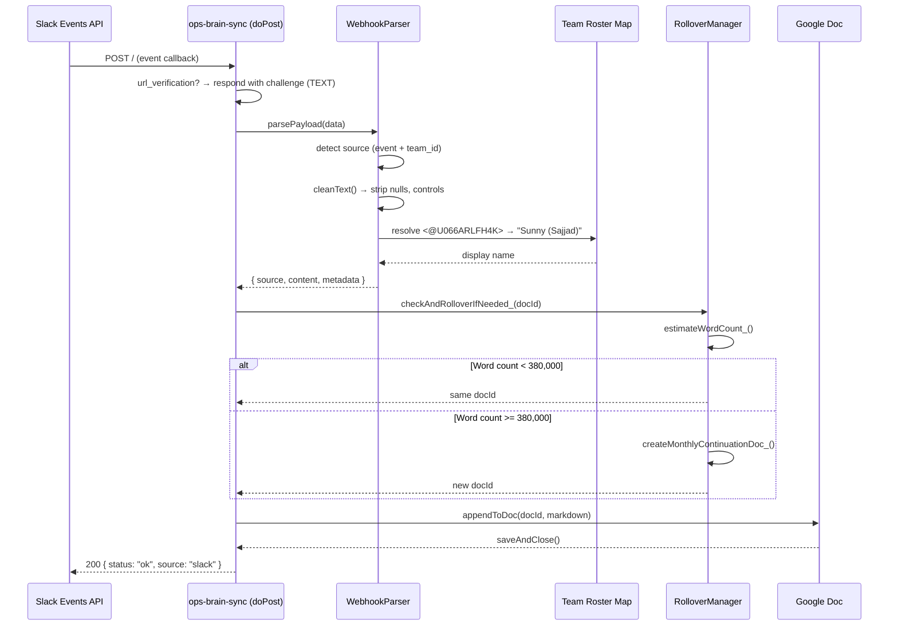

# ops-brain-sync

**Automated operations pipeline engine** connecting Slack webhooks, Fathom video recaps, Triple Whale analytics, Sellerboard financials, and Gmail confirmation matrices to a centralized Google Workspace data sync layer — optimized for high-accuracy NotebookLM contextual ingestion.

---

## Executive Overview

ops-brain-sync is a serverless Google Apps Script data integration engine that operates as both a real-time webhook receiver and a scheduled polling orchestration layer. It ingests operational intelligence from four primary data planes — team communications (Slack), meeting intelligence (Fathom), e-commerce analytics (Triple Whale), and financial performance (Sellerboard) — and pipes clean, structured Markdown into a centralized Google Doc repository for downstream AI-augmented retrieval in NotebookLM.

### Core Objectives

| Objective | Description |
|-----------|-------------|
| **Noise Minimization** | Strip webhook metadata, Slack internal IDs, and `@mention` piping syntax before ingest, preserving only human-readable business context |
| **Identity Translation** | Resolve raw Slack user IDs (`U066ARLFH4K`) to real-world display names via a centralized team roster — ensuring LLM context never contains opaque internal tokens |
| **RAG Optimization** | Structure every payload as clean hierarchical Markdown (`###`, `---`, sanitized key/value pairs) to maximize NotebookLM's chunking and retrieval precision |
| **Self-Healing Capacity** | Automatically detect document word-count thresholds (~380K) and spin up monthly continuation documents before hitting NotebookLM's 500K processing ceiling |

### Processing Statistics

| Constraint | Limit | Mitigation |
|-----------|-------|------------|
| Document word ceiling | ~380,000 (warning) / 500,000 (NotebookLM hard cap) | Automated monthly rollover via `safeCheckAndRollover_` |
| Script execution timeout | 6 minutes (Apps Script hard limit) | Time-batched polling; each fetcher runs independently with individual try/catch |
| Webhook payload truncation | ~15,000 characters per append (document bloat guard) | `cleanText()` strips control characters, collapses excess whitespace |
| Lock contention | 30,000 ms `LockService.waitLock` | Mutex on all write operations to prevent race conditions on concurrent triggers |

---

## System Architecture

The engine operates two concurrent core mechanisms: an **asynchronous webhook ingestion path** (`doPost`) for live Slack events, and a **time-driven sync engine** (`runBackgroundSyncs`) for scheduled API polling.

### Sequence Diagram: Slack Webhook Lifecycle



### Architecture Flowchart: Scheduled Sync Engine

```mermaid
flowchart TD
    Trigger[Time-Driven Trigger<br/>09:15 ET Daily] --> runBackgroundSyncs

    runBackgroundSyncs --> Lock{LockService<br/>waitLock 30s}

    Lock -->|Acquired| Fathom
    Lock -->|Acquired| TW[Triple Whale]
    Lock -->|Acquired| SB[Sellerboard]

    subgraph Fathom[Fathom Sync]
        F1[fetchRecentMeetings] --> F2[GET api.fathom.video/v1/meetings]
        F2 --> F3{HTTP 200?}
        F3 -->|Yes| F4[Dedup via<br/>FATHOM_PROCESSED_IDS]
        F3 -->|No| F5[Log error, return null]
        F4 -->|New meetings found| F6[Format Markdown<br/>title, summary, duration]
        F4 -->|None new| F7[Return null]
    end

    subgraph TW[Triple Whale Sync]
        T1[fetchTripleWhalePerformance] --> T2[POST api.triplewhale.com/v2/...]
        T2 --> T3{HTTP 200?}
        T3 -->|Yes| T4[Parse metrics JSON]
        T3 -->|No| T5[Log error, return null]
        T4 --> T6[Format Markdown table<br/>Metric | Value]
    end

    subgraph SB[Sellerboard Sync]
        S1[fetchSellerboardDaily] --> S2[GET CSV from<br/>SELLERBOARD_DAILY_LINK]
        S2 --> S3{HTTP 200?}
        S3 -->|Yes| S4[Parse CSV headers + rows]
        S3 -->|No| S5[Log error, return null]
        S4 --> S6[Extract last non-empty row]
        S6 --> S7[Format Markdown table<br/>Metric | Value]
    end

    Fathom --> Append
    TW --> Append
    SB --> Append

    subgraph Append[Doc Append Pipeline]
        A1[Rollover check] --> A2{Word count<br/>>= 380K?}
        A2 -->|No| A3[Use current doc]
        A2 -->|Yes| A4[Create YYYY-MM doc]
        A4 --> A5[Update TARGET_DOC_ID<br/>in ScriptProperties]
        A3 --> A6[appendToDoc]
        A5 --> A6
        A6 --> A7[saveAndClose]
    end

    Append --> Done[runBackgroundSyncs complete<br/>results: fathom/tw/sellerboard status]
```

---

## Module Inventory

| Module | File | Type | Responsibility |
|--------|------|------|----------------|
| **Ingress Controller** | `Code.js` | Entry point | `doGet` (health-check), `doPost` (webhook receiver), `runBackgroundSyncs` (scheduled orchestrator), `installBackgroundTrigger` (one-shot setup) |
| **Webhook Router** | `src/WebhookParser.js` | Parser | Route payloads by shape: Slack `event+team_id`, Fathom `recording`, Triple Whale `event_type+data`, Sellerboard `source`, generic fallback. Each produces `{ source, content, metadata }` |
| **Markdown Transformer** | `src/MarkdownFormatter.js` | Formatter | Convert parsed payloads to clean Markdown. Timestamps in `America/New_York`. Word-wrap at 100 chars for single paragraphs. Escape Markdown special chars |
| **Doc Writer** | `src/DocAppender.js` | Writer | Open doc by ID, split Markdown into paragraphs, apply `HEADING3` / `SUBTITLE` / `NORMAL` styling, `saveAndClose` |
| **Rollover Guard** | `src/RolloverManager.js` | Guard | Estimate word count via whitespace split. Create `ops-brain-sync YYYY-MM` doc at ~380K words. Update `TARGET_DOC_ID` in Script Properties |
| **Fathom Fetcher** | `src/FathomFetcher.js` | Poller | `GET api.fathom.video/v1/meetings` with Bearer token. Dedup via `FATHOM_PROCESSED_IDS` property. Reports title, URL, duration, summary per meeting |
| **Triple Whale Fetcher** | `src/TripleWhaleFetcher.js` | Poller | POST to Triple Whale summary endpoint with `x-api-key`. 7-day lookback. Renders metrics as a table |
| **Sellerboard Fetcher** | `src/SellerboardFetcher.js` | Poller | Fetch CSV from pre-signed URL, parse with quoted-field support, extract latest row, render as key/value table |

---

## Configuration

### Script Properties (Environment Control Plane)

Set these in the Apps Script editor under **Project Settings > Script Properties**, or programmatically via `PropertiesService.getScriptProperties()`:

| Property | Purpose | Required |
|----------|---------|----------|
| `TARGET_DOC_ID` | Primary Google Doc ID for Markdown output | Yes |
| `MASTER_SPREADSHEET_ID` | Master Operations & Data Matrix (SSOT) | Yes |
| `NOTEBOOK_SOURCE_FOLDER_ID` | Drive folder containing NotebookLM source docs | Yes |
| `FATHOM_API_KEY` | Fathom API Bearer token | Yes (for polling) |
| `TRIPLE_WHALE_API_KEY` | Triple Whale API key | Yes (for polling) |
| `SELLERBOARD_DAILY_LINK` | Pre-signed URL for daily Sellerboard CSV | Yes (for polling) |

### Timezone

All timestamps across the pipeline use `America/New_York` as the canonical timezone. Configured in `appsscript.json`:

```json
{
  "timeZone": "America/New_York",
  "runtimeVersion": "V8",
  "webapp": {
    "access": "ANYONE",
    "executeAs": "USER_DEPLOYING"
  }
}
```

---

## The Master Operations & Data Matrix

The **Master Operations & Data Matrix** (a Google Sheet identified by `MASTER_SPREADSHEET_ID`) serves as the single source of truth (SSOT) and configuration manager for the pipeline. It holds:

- **Script Properties Synchronizer** — Centralized registry for operational IDs (`TARGET_DOC_ID`, `NOTEBOOK_SOURCE_FOLDER_ID`) that the pipeline reads on each execution cycle
- **Self-Healing Spreadsheet Sanitization** — Validation routines (`sanitizeSpreadsheetId`, `getValidSpreadsheetId`) that intercept malformed input patterns (casing mismatches, trailing key artifacts) and resolve them via canonical matching to prevent catastrophic lockups
- **Volume Matrix Log Guard** — Tracks which document versions and months are active; cross-references with RolloverManager's word-count estimates so the pipeline never writes to a full doc

**SSOT Read Cycle** (executed at the start of `runBackgroundSyncs`):

```
Spreadsheet (MASTER_SPREADSHEET_ID)
  └── sheet: "Config"
        ├── TARGET_DOC_ID        → DocAppender
        ├── NOTEBOOK_SOURCE_FOLDER_ID → future use
        └── ROLLOVER_TRACKER     → RolloverManager
```

---

## Centralized Team Roster Mapping

To ensure raw Slack user IDs never reach NotebookLM, the pipeline maintains a centralized display-name translation dictionary. When `cleanSlackUserMentions` (or the equivalent regex pass in `WebhookParser`) encounters a `@mention` token, it resolves the embedded ID against this roster:

| Slack User ID | Display Name |
|---------------|--------------|
| `U066ARLFH4K` | Sunny (Sajjad) |
| `U4Y0JPMD4` | Rick Reichmuth |
| `U5206HQ00` | Diego Marquez |
| `U08F1V0FPDY` | Allyse C |
| `UQC0FDA2Z` | Stifany Ong |
| `U04PH549Z3N` | Paula Bacolod |
| `U08E1C77J77` | Arqam |
| `U03SW53P95E` | Mollie Cutillo |
| `U0AMTGG4XRD` | Marco Gastelum |

The resolution uses recursive regex lookarounds to handle both bare `<@U12345>` tokens and complex piping syntax like `<@U12345\|user>`:

```
Pattern:  /<@(U[A-Z0-9]+)(?:\|[^>]+)?>/g
Replace:  lookup[matchedId] || matchedId
```

If a user ID is not found in the roster, the raw `@mention` token is preserved rather than silently dropped — ensuring visibility into unmapped identities.

---

## Production Roadblocks & Edge-Case Mitigation

### Slack Identity Masking

**Problem:** Slack's Events API delivers user mentions as opaque internal IDs in both bare (`<@U12345>`) and piped (`<@U12345\|display>`) formats. Naive string replacement fails on the piping variant because the regex must match the optional `|user` segment without consuming the display label.

**Solution:** A two-pass sanitization strategy:
1. **Extract** — Regex extracts the user ID (`U[A-Z0-9]+`) from any `<@...>` token
2. **Resolve** — Look up the ID in the team roster map; if found, substitute the canonical display name. If not found, leave the token intact as a signal for roster maintenance

### Concurrency Lockouts

**Problem:** Apps Script's time-driven triggers can stack if one run exceeds the interval between triggers, causing two `runBackgroundSyncs` invocations to compete for the same document resource.

**Solution:** `LockService.getScriptLock().waitLock(30000)` at the entry point of every write operation. If a lock cannot be acquired within 30 seconds, the operation is abandoned with a console error rather than corrupting the document:

```
var lock = LockService.getScriptLock();
try {
  lock.waitLock(30000);  // Wait up to 30s for exclusive write access
  // ... write operations ...
} catch (e) {
  console.error('Could not acquire lock: %s', e.message);
} finally {
  lock.releaseLock();
}
```

### Payload Size & Truncation Boundaries

**Problem:** Overly large webhook payloads (e.g., Fathom transcripts exceeding 15K characters) create document bloat and risk running up against execution time limits.

**Solution:** Each module enforces a maximum content body of ~15,000 characters. `cleanText()` in `WebhookParser.js` strips control characters, null bytes, and collapses excessive blank lines before formatting. The 100-character word-wrap in `formatContentBody()` further constrains the final append size.

### NotebookLM Latency Boundary

**Critical operational checkpoint:** NotebookLM maintains **static cache snapshots** of Google Drive source documents. When new data is written:

```
Pipeline writes to Google Doc ✓
         │
         ▼
NotebookLM cache is STALE
         │
         ▼
Manual "Source Refresh" required in NotebookLM UI
```

The engine cannot programmatically trigger a NotebookLM refresh — no API exists for this. Users must click the refresh icon on the source document within NotebookLM after each sync cycle to update the AI model's context window.

### Document Rollover at Capacity

**Problem:** NotebookLM enforces a hard 500,000-word processing limit per document. Once breached, the document becomes inaccessible to the model.

**Solution:** The `RolloverManager` monitors document word count via `estimateWordCount_()` (whitespace splitting). At ~380,000 words (a 120K safety margin), it triggers `createMonthlyContinuationDoc_()`:

1. Creates a new doc named `ops-brain-sync YYYY-MM` via `DocumentApp.create()`
2. Writes an identifying header and timestamp
3. Persists the new doc ID to `TARGET_DOC_ID` in ScriptProperties
4. Returns the new ID — the caller seamlessly continues appending to the fresh document

---

## Quick Start

### Prerequisites

- Node.js >= 18
- Google account with [Apps Script API enabled](https://script.google.com/home/usersettings)

### Setup

```bash
# Clone the repository
git clone https://github.com/your-org/ops-brain-sync.git
cd ops-brain-sync

# Install clasp globally (or use npx)
npm install

# Authenticate with Google
npm run login

# Create the Apps Script project (one-time)
clasp create --type standalone

# Push all modules
npm run push

# Deploy as web app
npm run deploy
```

### One-Time Trigger Installation

After the initial deployment, open the script in the Apps Script editor:

```bash
npm run open
```

Select `installBackgroundTrigger` from the function dropdown and click **Run**. This creates a daily time-driven trigger at **09:15 ET** for `runBackgroundSyncs`. You'll need to authorize the trigger on first run.

---

## Development Commands

| Command | Action |
|---------|--------|
| `npm run login` | Authenticate clasp with Google |
| `npm run push` | Push local code to Apps Script |
| `npm run pull` | Pull remote code from Apps Script |
| `npm run deploy` | Deploy current version as web app |
| `npm run open` | Open the project in Apps Script editor |

---

## Webhook Endpoints

| Method | Path | Content-Type | Handler | Purpose |
|--------|------|-------------|---------|---------|
| `GET` | `/exec` | `application/json` | `doGet` | Health-check: `{ status, service, timestamp }` |
| `POST` | `/exec` | `application/json` | `doPost` | Webhook ingress (Slack, Fathom, Triple Whale, Sellerboard) |

### Slack url_verification Handshake

```bash
curl -X POST https://script.google.com/macros/s/{DEPLOY_ID}/exec \
  -H "Content-Type: application/json" \
  -d '{"type": "url_verification", "challenge": "abc123"}'

# Response: 200 OK (Content-Type: text/plain)
# abc123
```

---

## License

ISC — See [LICENSE](LICENSE) for details.
